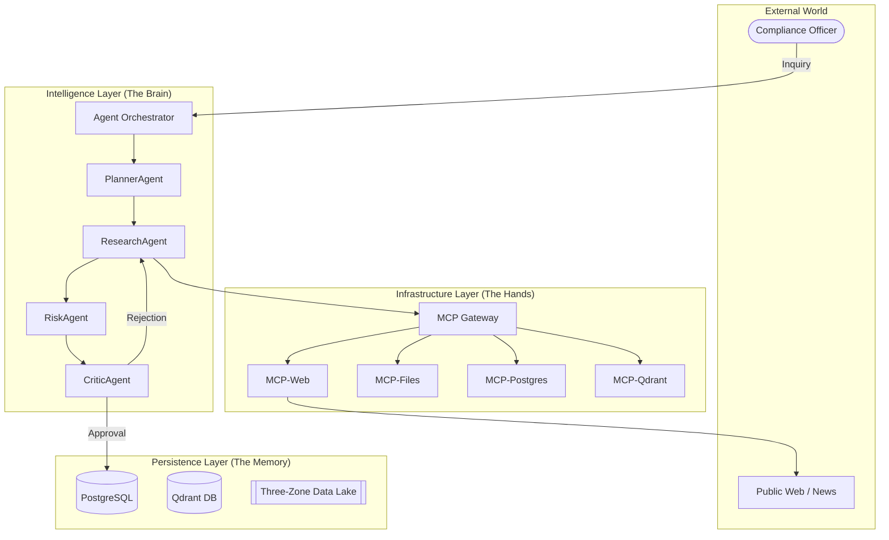

# VRIP OS: Vendor Risk Intelligence Platform
### *A Production-Grade, Autonomous AI Agent Operating System*

---

## 1. Executive Summary
The **Vendor Risk Intelligence Platform (VRIP)** is an enterprise-grade AI Operating System designed to autonomously identify, evaluate, and monitor vendor-related risks. Unlike traditional RAG applications, VRIP utilizes a **Multi-Agent Cognitive Architecture** built on **LangGraph**, abstracted tool execution via **Model Context Protocol (MCP)**, and a formal **Epistemic Model** to ensure high-fidelity, evidence-backed reasoning.

---

## 2. System Topology (High-Level)

---

## 3. Cognitive & Epistemic Foundations

### 🧠 Multi-Agent Orchestration
The "Brain" of the OS is built using **LangGraph**, allowing for stateful, cyclic reasoning:
*   **PlannerAgent**: Decomposes ambiguous requests into precise execution DAGs.
*   **ResearchAgent**: Executes tools to gather multi-modal evidence (Web, PDF, SQL).
*   **RiskAgent**: Evaluates evidence using the **Epistemic Model**.
*   **CriticAgent**: Performs adversarial review, checking for logical fallacies or stale evidence.

### 📐 Epistemic Reliability Model
Every piece of information in VRIP is a triplet: `(Claim, Evidence, Confidence)`.
*   **Evidence Tiers**: Tier 1 (Official Audits) weighs 1.0; Tier 5 (Unverified Social Media) weighs 0.2.
*   **Information Decay (Entropy)**: Confidence scores automatically decay over time. A 1-year-old SOC2 report has less "Truth Value" than a 1-day-old security breach report.

---

## 4. MCP Infrastructure Layer (The Tool Abstraction)
VRIP uses the **Model Context Protocol (MCP)** to decouple Agent reasoning from low-level infrastructure.

| Component | Responsibility | Fine-Grained Detail |
| :--- | :--- | :--- |
| **MCP-Web** | Intelligence Gathering | Scrapes news, filters SEO noise, and sanitizes content for LLM ingestion. |
| **MCP-Files** | Document Processing | High-fidelity PDF parsing (SOC2, ISO, 10-K) and entity extraction. |
| **MCP-Postgres**| Transactional Access | CRUD operations for Vendor profiles, Incidents, and Audit Logs. |
| **MCP-Qdrant** | Semantic Retrieval | Vector similarity search for finding historically related risks. |

---

## 5. Data Flow: The Request Lifecycle

### 💡 Example: "Analyze CloudScale Inc."

1.  **Ingress**: User triggers analysis via the API Gateway.
2.  **Planning**: `PlannerAgent` creates a plan: *"Search for Q3 financial news, retrieve 2024 SOC2 from Qdrant, and check for lawsuits in Postgres."*
3.  **Research**: `ResearchAgent` hits the **MCP Gateway**. It finds a "Tier 4" news article about a login leak.
4.  **Evaluation**: `RiskAgent` sees the leak. It notices Vendor X is **Mission-Critical**. It flags this as a **High Severity Risk**.
5.  **Critique**: `CriticAgent` notices the news is only 10 minutes old and from an unverified source. It commands the `ResearchAgent` to find a second source before finalizing.
6.  **Synthesis**: Once verified, a final report is generated and persisted to the Audit Log.

---

## 6. Production Deployment & Scaling

### 🐳 Containerization Strategy
*   **Mono-Repo Architecture**: All services reside in a unified directory structure for consistent CI/CD.
*   **Shared Base Image**: All Python services inherit from a hardened `vrip-shared-base` to ensure dependency parity and security patching.
*   **Orchestration**: Managed via `docker-compose` for local dev and Kubernetes (K8s) for production.

### 📈 Scaling the Intelligence
*   **Horizontal Scaling**: MCP servers can be scaled independently based on load (e.g., more `mcp-web` instances for heavy research periods).
*   **Inference Offloading**: High-performance reasoning is offloaded to **Groq**, ensuring the local OS overhead remains minimal while reasoning speed exceeds 200 tokens/sec.

---

## 7. Governance & Auditability
*   **Reasoning Traces**: Every decision made by an agent is saved as a "Trace," allowing human auditors to see exactly *why* a vendor's risk score was changed.
*   **Tamper-Evident Logs**: Audit logs are strictly append-only and immutable within the OS logic.

---

### *Generated by Antigravity AI Platform Architect*
