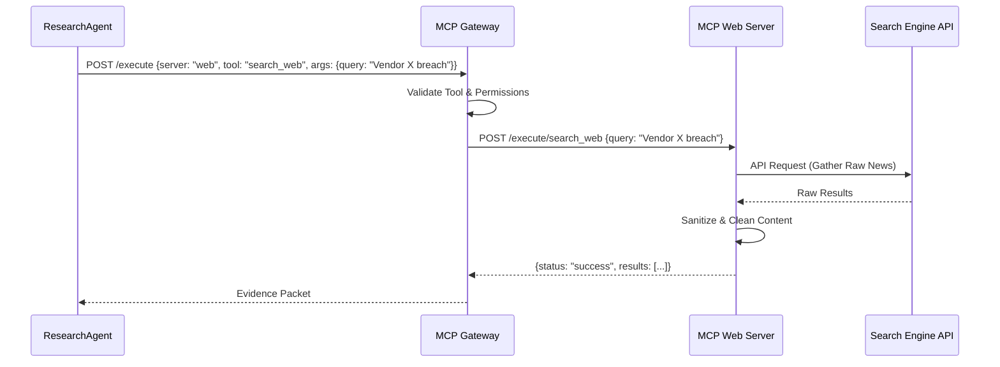

# VRIP System Architecture

This document provides a detailed technical overview of the Vendor Risk Intelligence Platform (VRIP) architecture, data flow, and component interactions.

## 1. High-Level Architecture Diagram

## 2. Component Descriptions

### Intelligence Layer (The Brain)
*   **Orchestrator**: Built using LangGraph, it manages the state machine of a risk analysis request.
*   **Agents**: Specialized "workers" that use Groq for reasoning. They do not have direct access to databases.
*   **Redis**: Stores episodic memory (the current conversation/analysis state) to allow for long-running reasoning tasks and human-in-the-loop pauses.

### MCP Layer (The Hands)
*   **MCP Gateway**: Enforces tool governance, security, and audit logging.
*   **Specialized Servers**: Each server encapsulates a specific capability (e.g., SQL execution, vector search, web scraping). This ensures agents only see high-level "tools" rather than low-level connection strings.

### Data Engineering Layer (The Memory)
*   **Airflow**: Orchestrates the movement of data from external feeds (RSS, News, Regulatory sites) into the platform.
*   **Three-Zone Data Lake**:
    1.  **Raw**: Original artifacts.
    2.  **Processed**: Extracted text and metadata.
    3.  **Curated**: Entities linked to the ontology.

## 3. Data Flow Lifecycle: "Analyze Vendor X"

1.  **Ingress**: User triggers a request via the Dashboard -> FastAPI.
2.  **Planning**: `PlannerAgent` decomposes the request. (e.g., "Check latest 10-K, search for recent data breaches, verify SOC2 status").
3.  **Evidence Gathering**: `ResearchAgent` calls `MCP-Web` for news and `MCP-Qdrant` for existing internal documents.
4.  **Evaluation**: `RiskAgent` processes the gathered evidence using the **Epistemic Model**. It calculates confidence scores based on source reliability and data freshness.
5.  **Validation**: `CriticAgent` reviews the reasoning. If evidence is contradictory or insufficient, it sends the request back to the `ResearchAgent`.
6.  **Synthesis**: `RecommendationAgent` generates the final report and actionable business advice.
7.  **Persistence**: The final risk report and reasoning trace are saved to **Postgres** for auditability.

## 4. Key Engineering Principles

*   **Epistemic Reliability**: Every claim must be supported by evidence stored in the platform.
*   **Ontology-First**: All data is structured according to the formal [Ontology](docs/ontology.md).
*   **Tool Decoupling**: Agents are agnostic of where data is stored; they only interact with the MCP layer.
*   **Observability**: Structured logs are emitted at every step, allowing for full tracing of an agent's "thought process."
## 5. MCP Layer Architecture: The Tool Interface

The Model Context Protocol (MCP) acts as the bridge between the high-level reasoning of the AI agents and the low-level execution of infrastructure tools.

### Why this design?
1.  **Security**: Agents never see database credentials. They only see "Tools" with strict input schemas.
2.  **Scalability**: New capabilities (e.g., a "Cyber Incident API") can be added as a new MCP server without touching the agent logic.
3.  **Observability**: Every tool call is logged at the MCP Gateway, providing a full audit trail of what the AI "did" to the system.

### Interaction Flow: "Gather News Evidence"

### 💡 Small Real-World Example

**Scenario**: You ask the system: *“Did Vendor X have a security breach?”*

1.  **Agent Request**: `ResearchAgent` receives your question and realizes it needs external info.
2.  **Governance**: `MCP Gateway` checks if the agent is authorized to use the "web" tools.
3.  **Discovery**: `MCP Web Server` is contacted to perform the search.
4.  **Collection**: The `Search API` gathers relevant news articles.
5.  **Refinement**: The server cleans and filters the results (removing ads/noise).
6.  **Delivery**: Final verified evidence is returned to the agent.

**Result**: The AI agent stays "inside" the secure OS environment while safely utilizing external tools without directly accessing the internet itself.

### Registered MCP Servers & Toolsets

| Server | Core Tools | Primary Responsibility |
| :--- | :--- | :--- |
| **mcp-postgres** | `query_vendor`, `audit_log` | Transactional data & history. |
| **mcp-qdrant** | `search_vendor_docs` | Semantic memory & similarity. |
| **mcp-web** | `search_web`, `get_content` | Real-time OSINT intelligence. |
| **mcp-files** | `parse_pdf`, `extract_entity` | Document understanding. |
| **mcp-risk-engine** | `calculate_risk_score` | Deterministic business logic. |

## 6. Data Orchestration Layer (Airflow)

Airflow acts as the **Circulatory System** of the VRIP platform, managing long-running, scheduled, and background data tasks.

### Why Airflow?
1.  **Continuous Intelligence**: Risk is "Always-On." Airflow ensures the platform is proactively gathering data even when no user is logged in.
2.  **Batch Processing (ETL)**: Parsing large PDF sets or generating embeddings is computationally expensive. Airflow handles these "Heavy Lifting" tasks outside the agent's real-time reasoning loop.
3.  **Data Integrity (Entropy Management)**: Automates the "Janitor Jobs" that mark old evidence as stale based on the [Entropy Model](docs/entropy_model.md).

### 💡 Small Real-World Example

**Scenario**: Monitoring 500+ vendors simultaneously.

*   **9:00 AM**: Airflow triggers `Ingestion_DAG`. It pulls 1,000 news headlines across all vendors.
*   **9:15 AM**: Airflow triggers `Embedding_DAG`. It transforms headlines into vectors and updates **Qdrant**.
*   **9:30 AM**: A user asks: *"Any critical updates?"*
*   **Result**: The Agent instantly identifies a breach reported 30 minutes ago because the data was pre-processed by Airflow.
