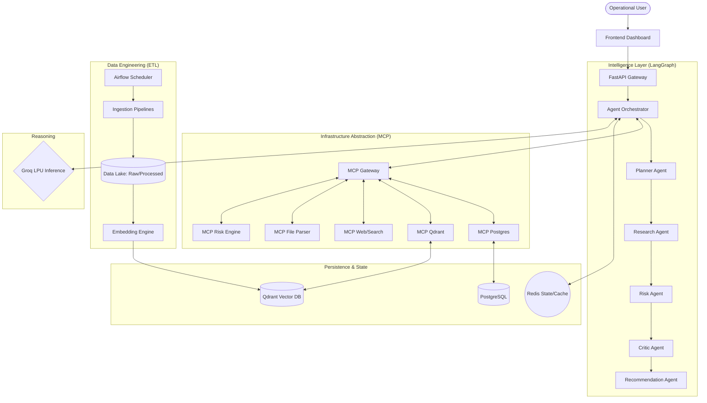

# VRIP System Architecture

This document provides a detailed technical overview of the Vendor Risk Intelligence Platform (VRIP) architecture, data flow, and component interactions.

## 1. High-Level Architecture Diagram

## 2. Component Descriptions

### Intelligence Layer (The Brain)
*   **Orchestrator**: Built using LangGraph, it manages the state machine of a risk analysis request.
*   **Agents**: Specialized "workers" that use Groq for reasoning. They do not have direct access to databases.
*   **Redis**: Stores episodic memory (the current conversation/analysis state) to allow for long-running reasoning tasks and human-in-the-loop pauses.

### MCP Layer (The Hands)
*   **MCP Gateway**: Enforces tool governance, security, and audit logging.
*   **Specialized Servers**: Each server encapsulates a specific capability (e.g., SQL execution, vector search, web scraping). This ensures agents only see high-level "tools" rather than low-level connection strings.

### Data Engineering Layer (The Memory)
*   **Airflow**: Orchestrates the movement of data from external feeds (RSS, News, Regulatory sites) into the platform.
*   **Three-Zone Data Lake**:
    1.  **Raw**: Original artifacts.
    2.  **Processed**: Extracted text and metadata.
    3.  **Curated**: Entities linked to the ontology.

## 3. Data Flow Lifecycle: "Analyze Vendor X"

1.  **Ingress**: User triggers a request via the Dashboard -> FastAPI.
2.  **Planning**: `PlannerAgent` decomposes the request. (e.g., "Check latest 10-K, search for recent data breaches, verify SOC2 status").
3.  **Evidence Gathering**: `ResearchAgent` calls `MCP-Web` for news and `MCP-Qdrant` for existing internal documents.
4.  **Evaluation**: `RiskAgent` processes the gathered evidence using the **Epistemic Model**. It calculates confidence scores based on source reliability and data freshness.
5.  **Validation**: `CriticAgent` reviews the reasoning. If evidence is contradictory or insufficient, it sends the request back to the `ResearchAgent`.
6.  **Synthesis**: `RecommendationAgent` generates the final report and actionable business advice.
7.  **Persistence**: The final risk report and reasoning trace are saved to **Postgres** for auditability.

## 4. Key Engineering Principles

*   **Epistemic Reliability**: Every claim must be supported by evidence stored in the platform.
*   **Ontology-First**: All data is structured according to the formal [Ontology](docs/ontology.md).
*   **Tool Decoupling**: Agents are agnostic of where data is stored; they only interact with the MCP layer.
*   **Observability**: Structured logs are emitted at every step, allowing for full tracing of an agent's "thought process."
