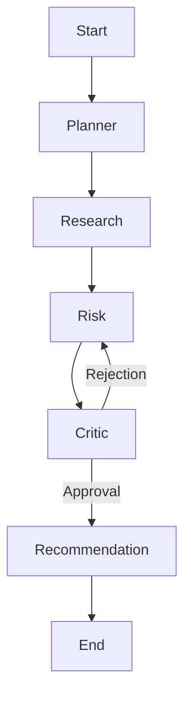

# Cognitive Architecture - VRIP Agent OS

This document outlines the multi-agent reasoning framework and orchestration logic.

## 1. Agent Roles & Responsibilities

### PlannerAgent (The Architect)
- **Input**: User request (e.g., "Analyze Vendor X").
- **Task**: Decompose the request into a directed acyclic graph (DAG) of sub-tasks.
- **Output**: Execution plan for the orchestration controller.
- **💡 Example**: User asks to "Assess Vendor X." Planner creates a 3-step plan: 1. Fetch SOC2 from internal docs, 2. Search web for recent breaches, 3. Check latest quarterly earnings.

### ResearchAgent (The Inquisitor)
- **Tool Access**: `mcp-web`, `mcp-files`, `mcp-qdrant`.
- **Task**: Gather raw evidence based on the plan.
- **Output**: Structured evidence packets with source metadata.
- **💡 Example**: Follows the plan to hit the `mcp-web` tool and finds a news article from *Reuters* about a login page vulnerability at Vendor X.

### RiskAgent (The Evaluator)
- **Tool Access**: `mcp-risk-engine`, `mcp-postgres`.
- **Task**: Apply the Epistemic model to the gathered evidence.
- **Output**: Multi-dimensional risk scores and reasoning traces.
- **💡 Example**: Takes the *Reuters* article, weights it as Tier 4 (0.6 weight), and calculates that the "Security Risk" score should increase by 15 points because Vendor X is a "Mission-Critical" provider.

### CriticAgent (The Adversary)
- **Task**: Challenge the RiskAgent's reasoning. Look for logical fallacies, ignored evidence, or over-confidence.
- **Output**: Approval or Rejection with feedback.
- **💡 Example**: Rejects the RiskAgent's score: *"You increased risk based on a Reuters report, but the official SOC2 (Tier 1) says this was patched. Please verify if the patch is confirmed before finalizing the score."*

### RecommendationAgent (The Strategist)
- **Task**: Translate risk scores into actionable business recommendations.
- **Output**: Final Risk Report.
- **💡 Example**: Translates the score into a business decision: *"Risk is moderate. RECOMMENDATION: Proceed with the contract but add a 'Security Patch SLA' clause to the agreement."*

### MemoryAgent (The Librarian)
- **Task**: Manage episodic and semantic memory across analysis sessions.
- **Output**: Contextually relevant historical patterns.
- **💡 Example**: Recalls that "Vendor X had a similar incident 2 years ago" and provides the previous resolution to the RiskAgent for context.

## 2. Orchestration Flow (LangGraph)
The system uses a stateful graph where nodes represent agents and edges represent transitions.

## 3. Memory Management
- **Episodic Memory**: Current task context, reasoning traces, and intermediate results (Redis).
- **Semantic Memory**: Historical vendor patterns and cross-vendor risk signals (Qdrant).
- **Procedural Memory**: System prompts, tool schemas, and successful reasoning paths (Postgres).
