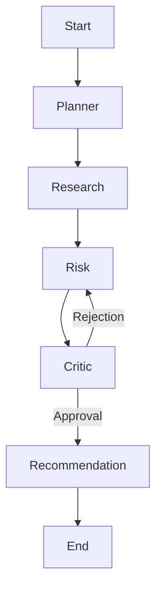

# Cognitive Architecture - VRIP Agent OS

This document outlines the multi-agent reasoning framework and orchestration logic.

## 1. Agent Roles & Responsibilities

### PlannerAgent (The Architect)
- **Input**: User request (e.g., "Analyze Vendor X").
- **Task**: Decompose the request into a directed acyclic graph (DAG) of sub-tasks.
- **Output**: Execution plan for the orchestration controller.

### ResearchAgent (The Inquisitor)
- **Tool Access**: `mcp-web`, `mcp-files`, `mcp-qdrant`.
- **Task**: Gather raw evidence based on the plan.
- **Output**: Structured evidence packets with source metadata.

### RiskAgent (The Evaluator)
- **Tool Access**: `mcp-risk-engine`, `mcp-postgres`.
- **Task**: Apply the Epistemic model to the gathered evidence.
- **Output**: Multi-dimensional risk scores and reasoning traces.

### CriticAgent (The Adversary)
- **Task**: Challenge the RiskAgent's reasoning. Look for logical fallacies, ignored evidence, or over-confidence.
- **Output**: Approval or Rejection with feedback.

### RecommendationAgent (The Strategist)
- **Task**: Translate risk scores into actionable business recommendations.
- **Output**: Final Risk Report.

## 2. Orchestration Flow (LangGraph)
The system uses a stateful graph where nodes represent agents and edges represent transitions.

## 3. Memory Management
- **Episodic Memory**: Current task context, reasoning traces, and intermediate results (Redis).
- **Semantic Memory**: Historical vendor patterns and cross-vendor risk signals (Qdrant).
- **Procedural Memory**: System prompts, tool schemas, and successful reasoning paths (Postgres).
